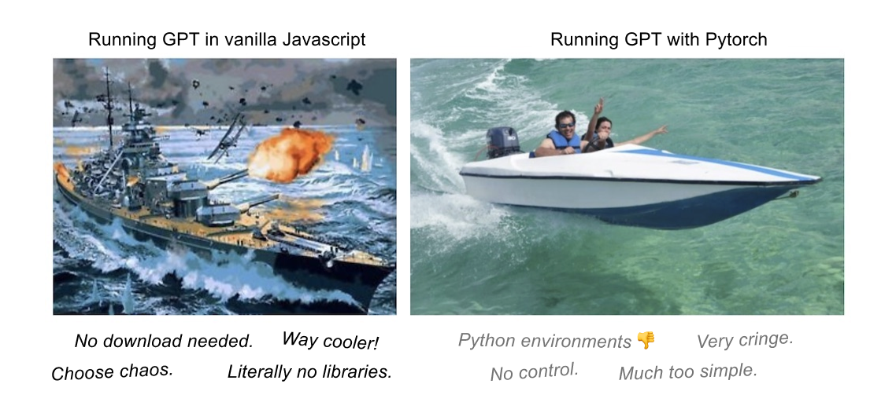
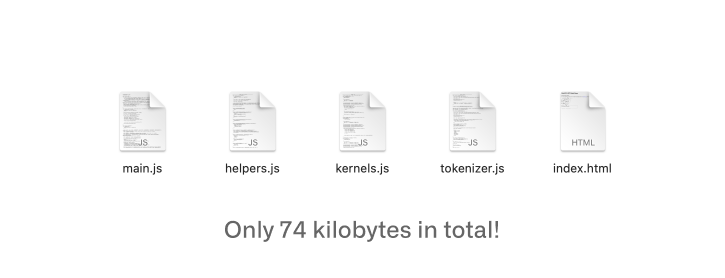

# WebGPT

After six years of development, WebGPU is about to launch across most major web browsers. This is massive: web applications now have near-native access to the GPU, with the added capacity of compute shaders.

WebGPT is a vanilla JS and HTML implementation of a transformer model, intended as a proof-of-concept as well as educational resource. WebGPT has been tested to be working with models up to 500 M parameters, though could likely support far more with further testing/optimization.

### Current Stats
2020 M1 Mac: 3ms/token at 5M parameters with f32 precision.
2020 M1 Mac: 30ms/token at 117M parameters with f32 precision.
2020 M1 Mac: 70ms/token at 377M parameters with f32 precision.
2020 M1 Mac: 120ms/token at 775M parameters with f32 precision.
1.5B is workign but unstable, sitting around 1000ms/token due to inefficiencies.

## Running WebGPT

Running WebGPT is remarkably simple, as it's just a set of HTML + JS files. Since WebGPU is still in the process of being released, you'll need to open with a compatible browser. WebGPU is currently available on Chrome v113 but the most straightforward way to ensure proper functionality is to install [Chrome Canary](https://www.google.com/chrome/canary/) or Edge Canary.

I've included two different models: a toy GPT-Shakespeare model (which is severly undertrained haha) and GPT-2 117M. See main.js for more information on how to run these models. If you want to import custom models, take a look at misc/conversion_scripts.

If you want to try out WebGPT, visit the demo website here [KMeans.org](https://www.kmeans.org). I'd generally reccomend cloning the repo and running locally, just because loading the weights remotely is significantly slower.  
Note: **You'll need to use Git LFS** to download the model files, after cloning the repository.

## Roadmap / Fixing Stupid Decisions

- [x] Embeddings / de-embeddings on GPU.
- [x] Initializing pipelines on every step is incredibly inefficient.
- [x] Key-value caching.
- [x] Reuse buffers.
- [x] Kernel shared memory for matmul!
- [x] Destroy buffers after use!
- [x] Create kernel instruction classes + optimize pipeline creation.
- [ ] Run selection ops on GPU (topk, selection softmax)
- [ ] Fuse all kernels.
- [ ] Investigate why attention cache isn't giving proper speed-ups.
- [ ] Make simple instructional version without special stuff.
- [ ] Optimize workgroup sizes, specifically for single row/col operations.
- [ ] Optimize all other kernels.
- [ ] Convert into a package.
- [ ] Compute pass splitting for larger models _(maxStorageBufferBindingSize)_
- [ ] Write better comments + make Youtube explainer.

## Acknowledgements

When I started this project I had no idea how transformers worked or how to implement them (or GPUs or matmul kernels or WebGPU or tokenization for that matter), so Andrej Karpathy's series on neural networks and building GPT from scratch were invaluable: [Andrej's Youtube](https://www.youtube.com/@AndrejKarpathy). I've also used some code as well from the nanoGPT repository: [nanoGPT](https://github.com/karpathy/nanoGPT).

I copied from LatitudeGames' implementation of OpenAI's GPT-3 tokenizer in Javascript: [GPT-3-Encoder](https://github.com/latitudegames/GPT-3-Encoder).

## Note: I'm looking for work!

I'm currently in the process of switching into the AI field. I'm specifically looking for opportunites at larger research labs in a variety of jobs, with the goal of breaking into the space and finding an area in which to specialize. If you're interested, check out my personal website: [Personal Website](https://depue.design/)
